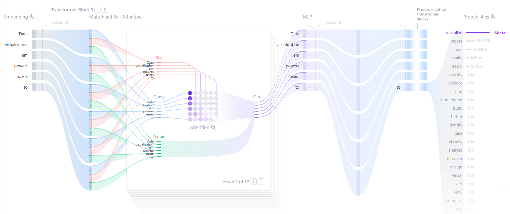
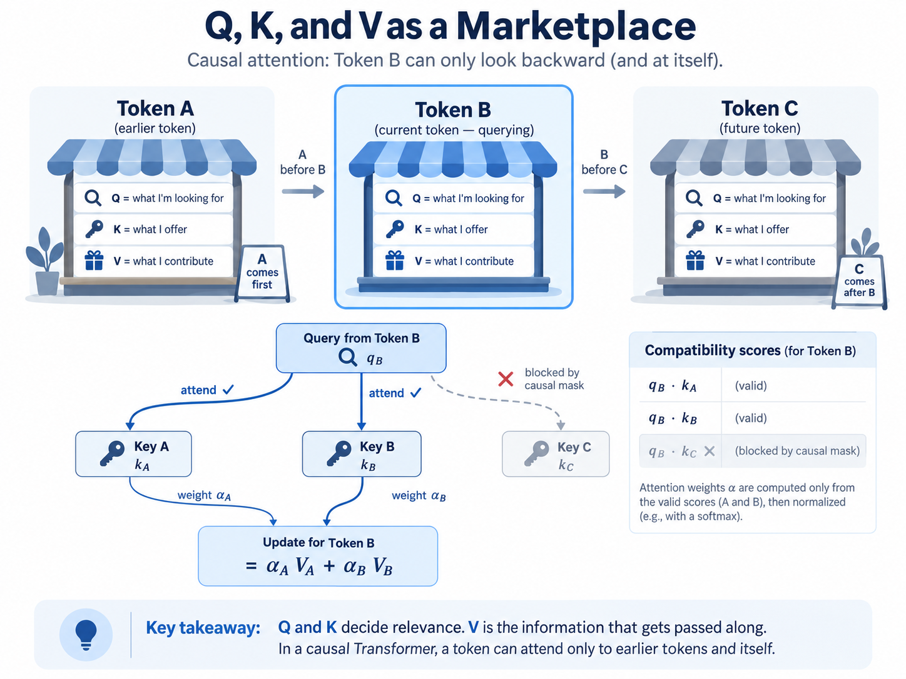
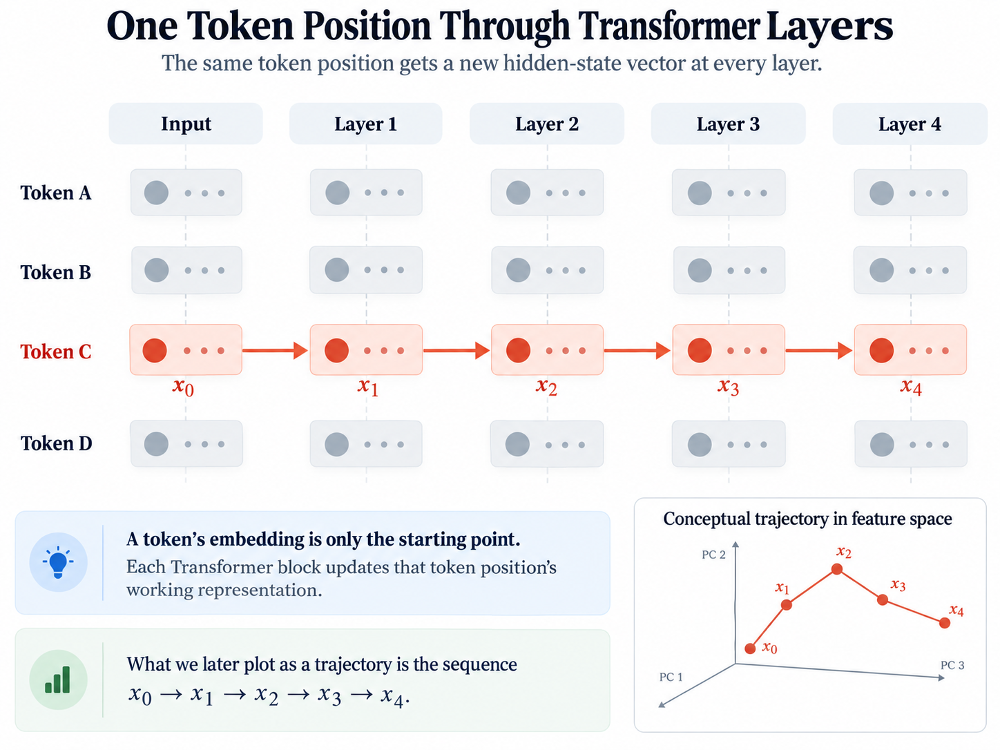
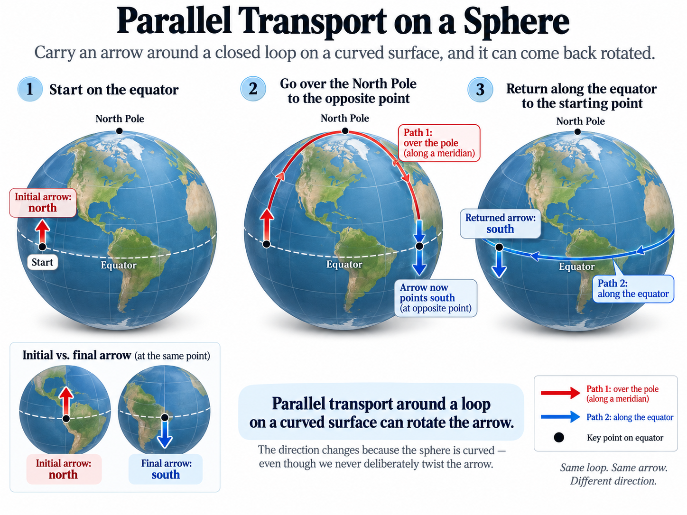
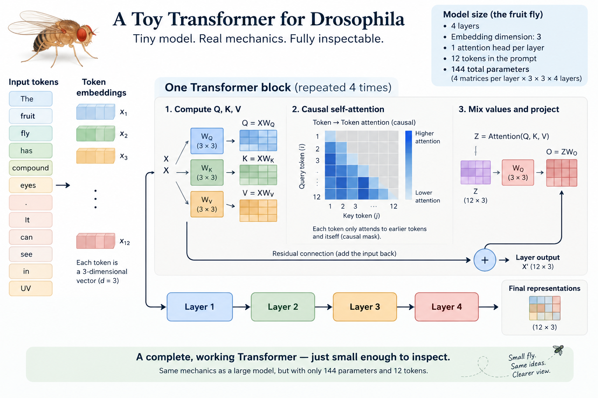
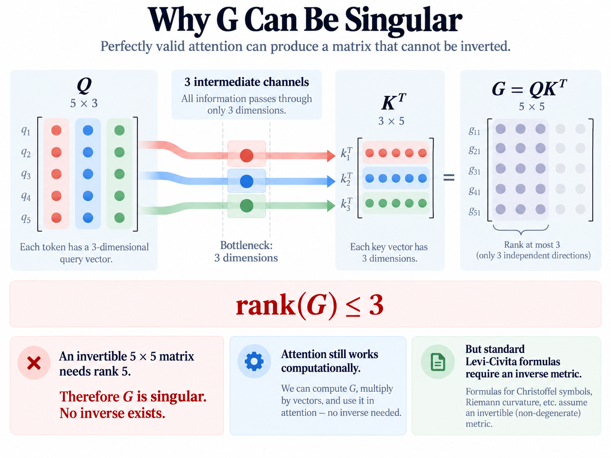
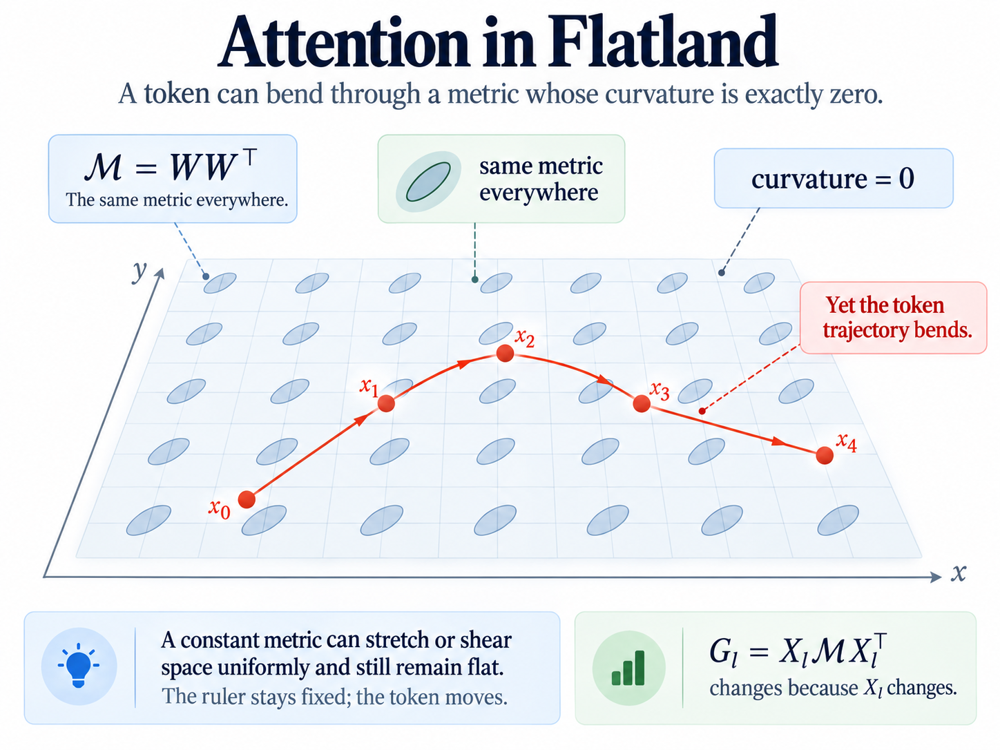
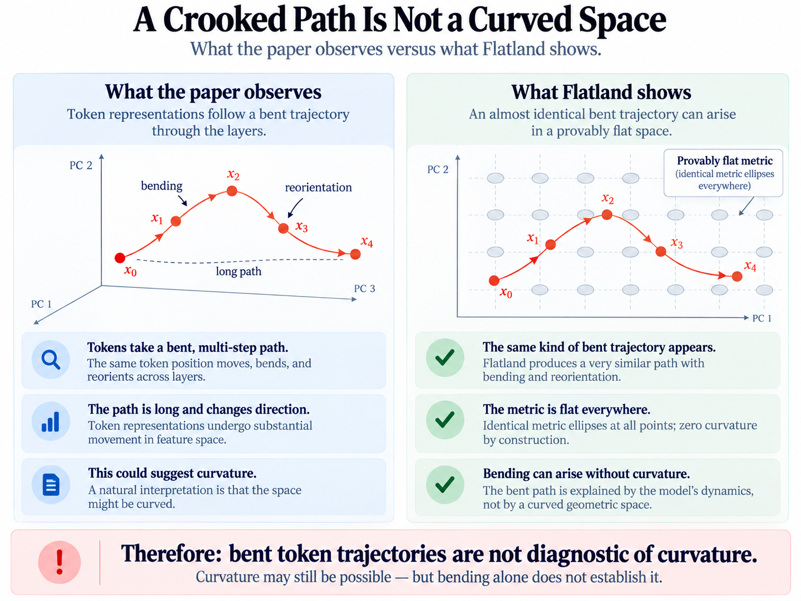

# A Crooked Path through Space and Semantics

I recently came across a paper with the, intentionally I’m sure, provocative title of “The Curved Spacetime of Transformer Architectures”. ([https://arxiv.org/abs/2511.03060](https://arxiv.org/abs/2511.03060)).

That sounds so cool. Thinking of some words bending the representation space around them, pulling other words towards them. And the seductive elegance of it. A peek at the capital T Truth. Perhaps the same set of universal laws govern phenomena as disparate as language and gravity.

I wanted to see it.

One of the paper’s central claims, as stated right upfront is:

“…token embeddings should not traverse straight paths in feature space; instead, their layer-wise steps should bend and reorient as interactions are mediated by embedding-space curvature.”

More simply: if you follow the vector representation associated with one token through one layer of a transformer to the next, then its path will bend. The claim is there is an analogy between the path through a transformer and that of particles through physical spacetime with attention playing the role of massive objects.

That is a testable idea—or at least it ought to be.

I built a deliberately tiny Transformer so that every weight, vector, matrix multiplication, and trajectory could be inspected directly and reasoned about. The results are:

1.  **A token can trace a sharply bent path through a space whose metric is provably flat.** Curvature is therefore not required to produce a crooked token trajectory.

2.  **The paper’s proposed route from attention to geometry does not work as written for many perfectly valid attention blocks.** In particular, matrices that its construction needs to invert can be singular by design.

Neither result proves that geometry is a useless way to think about Transformers, nor that attention can never be described using curved geometry. They establish something narrower: **the observed bending of token trajectories is not, by itself, evidence of curvature, and the proposed geometric construction needs more justification before curvature can be calculated from it.**

The path to these conclusions is, fittingly enough, crooked. Along the way we will visit Einstein, the humble fruit fly, and take apart just enough of a Transformer to see what makes it tick.

## Gravity is Getting Me Down

In all western history, the person most famous for being smart is Albert Einstein. I suspect that if you were on the Family Feud and the category was smart people, that the survey would say “Einstein” in a landslide.

Among much else, Einstein developed the theory of General Relativity. He took the understanding of gravity from a mysterious and invisible force that reaches out, unseen, through space and grounded it instead as a consequence of the geometry of spacetime itself.

The analogy presented in school is that spacetime is like a mattress. Put a bowling ball on it and the surface deforms. Roll a smaller ball nearby and its path bends because the surface underneath it is no longer flat.

The analogy is imperfect, but it gives us the concept we need.

1.  Take a picture of some stars. Implementation detail: you’ll need to carefully choose stars that will appear to be very close to the sun during the next solar eclipse.

2.  Wait until a total solar eclipse. Yes, this might take a little while.

3.  Take a picture of those same stars.

4.  Very precisely, measure the positions of those stars relative to each other.

The stars will appear to be in slightly different positions. The stars have not suddenly jumped around the galaxy. Their light has passed through the region near the Sun on its way to us.

Our everyday intuition says that light travels in a straight line. General Relativity teaches that light follows a **geodesic**: the locally straightest path available through spacetime. Near a massive object such as the Sun, spacetime is curved, so a locally straight path through that geometry can appear curved when viewed from farther away.

Better still, this is not merely a visual analogy: there’s a bunch of math behind it! The theory predicts **how much** the light should be deflected. A ray passing closer to the Sun should be deflected more than one passing farther away.

## Transformers. More than Meets the Eye.

If we want to test whether a Transformer bends semantic space, we first need to say what is supposedly moving.

To set the stage, here is a quick summary of how Transformers work, and we can define some terms along the way. For our purposes, an autoregressive LLM has a simple high-level flow:

**text → tokens → embeddings → many Transformer blocks → next-token prediction**

The tokenizer breaks the input into discrete pieces of text called **tokens**. Each token corresponds to a **token ID** which is an integer. Imagine making a spreadsheet of every word (properly token). The token ID would be the row number. The token ID is then used to look up an initial vector called an **embedding**.

So a word-like token such as bank might begin life inside the model as something like

$$
x=(0.13,-0.72,0.04,\ldots)
$$

with hundreds or thousands of coordinates.

Those coordinates do not correspond neatly to human concepts like *financialness* or *riverbankness*. But taken together, the vector defines a point in a very high dimensional space. Tokens with related meanings tend to end up near to one another in this space, which is why we think of it as a **semantic space**.

Once inside the Transformer, however, that initial embedding is only the starting point. The learned embedding vector for a given token is fixed: the same token starts from the same vector before any other context is taken into account. But language is beautiful and expressive. The same word can have different denotations, connotations, implications, moods,or tones. It can be funny or sarcastic, melancholy or ecstatic, threatening or tender. The language model captures this richness of meaning and experience by adjusting the many values of working representation as it passes through the Transformer. Here I’ll call this vector representation of a token in the Transformer a “working representation”, but you may see others call this a “hidden state”.

Each token position carries a working vector representation, which I’ll write as X. Every Transformer block takes the current working representations and produces new ones:

$$
X_0\rightarrow X_1\rightarrow X_2\rightarrow\cdots
$$

Those changing working representations are the points we will later plot as a trajectory.

Credit to Poloclub for this fantastic visualization of how a Transformer is structured. 



https://poloclub.github.io/transformer-explainer/

## Attention as a marketplace

Let’s build a mental model of what the query, key, and value are doing because this is the mechanism that the paper says we can interpret geometrically.

Understanding language is inherently a many-to-many matching problem. Language is as expressive as it is precisely because of how words interact and change the interpretation of other words. Mathematically, the working representation of one token should be able to change the working representation of another token in this semantic space we’ve defined.

A useful analogy is a marketplace. Every participant is simultaneously a buyer and a seller. As a buyer, it advertises what it is looking for. As a seller, it advertises what it has available. This is not especially strange—most businesses both buy things from others and sell things of their own.

A token position’s current working representation (X) is projected into three different vectors. Its **query (Q)** represents what information it is looking for. Its **key (K)** represents what kind of information it has available to match against. Its **value (V)** is the information it can actually contribute if another token position pays attention to it. The model compares each query with every eligible key. Those query–key matches determine how much of each corresponding value gets mixed into the update.



The matching itself is simple. Each query is compared with every eligible key using a dot product. One comparison produces a single number: a compatibility score. Do this for every eligible pair and we get a whole matrix of scores,

$$
QK^\top.
$$

There is some further downstream processing which we can think about as combining Q, K, and V, and getting the output into the same shape as the input. This way we can send the result through another Transformer layer (GPT2 used 12 such layers, and modern LLMs use many more).

The important fact for us is that each token position goes into the block with one working representation and comes out with another one of the same dimensionality.

Now we have something we can visualize. Pick one token position and record its working representation before the first block as $X_0$, after the first block as $X_1$, after the second as $X_2$, and so on. Each one is a point in the same high-dimensional representation space. Connect those points and we get a trajectory:

$$
X_0 \rightarrow X_1 \rightarrow X_2 \rightarrow X_3 \rightarrow \cdots
$$



The connecting lines are just a visualization—there is not really a sense in which the token traverses the space between the points. The actual computation jumps discretely from one working representation to the next. But the sequence of points still gives us a perfectly meaningful path to study.

In general, that path will be crooked. And this is where the paper’s central question begins. Are we simply looking at a sequence of neural-network transformations that happen to send the representation in different directions through an ordinary flat vector space? Or is the representation following something like a locally straight—or **geodesic**—path through an underlying geometry that is itself curved?

Those two stories can produce the same squiggly-looking line. The challenge is figuring out how to tell them apart.

## Staggering

Hundreds or thousands of dimensions are hard to visualize, so let’s come back down to three.

Imagine looking from space at the path traced by a train crossing the country. The line will curve. Some of that may be because the track itself turns. Some may be because the track follows the curvature of the Earth. And some may be both.

If I show you only the line, you cannot tell which story is true. The train might have followed:

1.  a crooked path through flat space,

2.  a locally straight—or **geodesic**—path through curved space, or

3.  a crooked path through curved space.

That is exactly our problem with the Transformer. A squiggly trajectory tells us that the trajectory is squiggly. It does not, by itself, tell us whether the space underneath it is curved.

Fortunately there is a strong mathematical test for this.

Imagine you stick one arm out in front of you and walk around a loop. However you are not allowed to move your arm or turn or twist your body. To walk sideways you have to sidestep and keep facing forward. Mathematicians call this **parallel transport**.

On a flat sheet of paper, parallel transport around any closed loop returns it pointing the same way it started. But on the surface of a globe, that is not necessarily true. Imagine starting on the equator with an arrow (your arm) pointing north. Draw a path from the equator, up over the north pole, to the equator on the other side, then along the equator back to the start. Once you hit the equator on the other side, your arrow is now pointing south. Walking along the equator back to your original point does not change this, and when you arrive at your starting point the arrow is still pointing south.



This gives us a formal way to detect curvature without relying on the appearance of a particular path. We need to define two terms here: a “metric” and a “connection”.

A **metric** is a rule that defines how lengths and angles are measured at every point in the space. You can think of it as a local ruler and protractor: given a small change in the coordinates used to describe the space, the metric tells you how long that change actually is.

A **connection** is a rule for comparing directions at neighboring points. It tells us what “do not turn the arrow” means as we move through the space.

Many different connection rules can be invented, but an ordinary Riemannian metric picks out one special natural choice: the **Levi-Civita connection**. It is the unique connection that preserves the lengths and angles defined by the metric and has zero torsion—roughly, it introduces no additional built-in skew in the transport rule beyond what follows from the geometry itself.

A connection is the Levi-Civita connection of a given metric if it is both metric-compatible and torsion-free.

$$
\nabla g=0,\qquad T=0.
$$

This gives us a much cleaner experimental program for the Transformer:

- define the geometry

- derive its Levi-Civita connection

- calculate the curvature implied by that connection

- and only then ask whether the token trajectory behaves like a geodesic of that geometry.

## An Almost Minimal Example

Drosophila melanogaster is the scientific name for a fruit fly. The interesting thing about Drosophila is that it is profoundly uninteresting. And yet the Drosophila is perhaps the most widely studied and most well-understood animal on earth. They are small and cheap and reproduce quickly and prolifically. Their genome is tiny, only four pairs of chromosomes, simple to manipulate, and results in mutations that are readily visible. We study Drosophila not because they are useful, but because it is easy and many of the results generalize.

Drosophila is nature’s toy example.

Modern Transformers have the opposite problem. They are enormous. A production language model may contain billions of parameters, hundreds or thousands of dimensions, many attention heads, and dozens or hundreds of layers. If we want to understand a mathematical claim about Transformers themselves, all of that complexity gets in the way.

So let’s build the Drosophila of Transformers, not because the Transformer will be useful but because it is easy and the results will generalize.

It does not need to speak English. It does not need to predict anything useful. It does not even need to be trained. We only need enough of the Transformer mechanism to preserve the machinery we want to study: working representations, query/key/value projections, attention, output projection, residual updates, and repeated layers.

Our toy has:

- **2 token positions**

- **model dimension $d_{\text{model}}=3$**, so every working representation contains three numbers

- **3-dimensional Q, K, and V vectors**

- **1 causal attention head**

- **4 attention-only layers**

- **no biases, normalization, or feed-forward network**

Three dimensions are especially convenient because we can literally plot the working representations as points in ordinary 3-D space. It also keeps all of the matrix arithmetic small enough to inspect by hand.

Each layer contains four $3\times3$ weight matrices:

$$
W_Q,\quad W_K,\quad W_V,\quad W_O.
$$

Given the current working representations (X), the layer computes

$$
Q=XW_Q,\qquad K=XW_K,\qquad V=XW_V.
$$

The query-key comparisons produce attention scores,

$$
\frac{QK^\top}{\sqrt{3}},
$$

after which we apply the causal mask and softmax to obtain attention weights (A). The values are mixed according to those weights, projected through $W_O$, and added back to the incoming representation through the residual connection:

$$
X+(AV)W_O.
$$

That is the entire machine.

With four $3\times3$ matrices per layer, each layer contains

$$
4\times 3\times 3=36
$$

weights. Four layers therefore give us only

$$
4\times36=144
$$

weights in the entire Transformer.



None of these weights need to be learned. We can fill them with random numbers or choose particular values deliberately depending on the experiment. Training is irrelevant to the mathematical question we are asking.

A quick aside on causal attention. A common design choice is to use “causal” matching (as in the “cause and effect” sense of the word). Words earlier in a sentence can affect the meaning of words later in a sentence but not the other way around. Mathematically this is done by setting some values of the attention matching matrix to negative infinity. This might seem limiting because intuitively we know that later words can affect the meaning of earlier ones. Comedians exploit this routinely. For example Mitch Hedberg’s classic one-liner “I used to do drugs. I still do, but I used to, too”. This is a topic much bigger than this paper, so we will short cut it by saying that the goal of the transformer block is to set us up for success in predicting the next token, and not getting a semantically perfect representation of every token along the way. Short answer: it's imperfect but it works!

This tiny system contains the same attention operations whose geometry we want to investigate, while being small enough that we can inspect every number.

Now we can ask the real question.

**If attention defines a geometry, can we calculate that geometry before using a token’s trajectory as evidence that the geometry is curved?**

## Calculating the Geometry

If attention defines a geometry, we ought to be able to calculate it.

Let’s walk from our tiny Transformer to the object the paper calls an **effective metric**.

Our Drosophila Transformer has two token positions, each with a three-dimensional working representation. At some layer we can therefore write

```math
X=\begin{bmatrix}
x_A \\
x_B
\end{bmatrix},\qquad X\in\mathbb{R}^{2\times3}.
```

Each row is the current location of one token representation in our three-dimensional representation space.

The layer contains query and key projection matrices

$$
W_Q,W_K\in\mathbb{R}^{3\times3}.
$$

These are simply weight matrices. In our toy they do not need to have been learned.

We calculate

$$
Q=XW_Q,\qquad K=XW_K.
$$

So $Q$ and $K$ are also $2\times3$. Each token now has a three-dimensional query and a three-dimensional key.

Using our marketplace analogy:

- $q_A$: what A is looking for

- $k_A$: what A advertises

- $q_B$: what B is looking for

- $k_B$: what B advertises

Now compare every query with every key:

$$
G=QK^\top.
$$

The dimensions are

$$
(2\times3)(3\times2)=2\times2.
$$

Explicitly,

```math
G=\begin{bmatrix}
q_A^\top k_A & q_A^\top k_B \\
q_B^\top k_A & q_B^\top k_B
\end{bmatrix}.
```

Perhaps numerically we obtain something like

```math
G=\begin{bmatrix}
1.2 & -0.4 \\
2.1 & 0.7
\end{bmatrix}.
```

This is completely ordinary Transformer computation. These numbers are the raw query-key compatibility scores, before scaling, masking, and softmax.

In marketplace language, the rows are buyers and the columns are sellers. The entry in row A, column B tells us how well what A wants matches what B offers.

So far: **zero differential geometry. We have just computed attention scores.**

The paper’s conceptual move is to write these entries as

$$
g_{ij}=q_i^\top k_j
$$

and interpret $G$ as an **effective metric**.

This is where we need to slow down.

A metric on our three-dimensional representation space would ordinarily tell us how to measure lengths and angles between directions in that three-dimensional space. In coordinates, we would expect an object with one index for each of the three representation-space directions: in our toy, a $3\times3$ matrix.

But $G$ is $2\times2$.

Its indices do not label the three coordinates of representation space. They label the **two token positions**.

That is an important distinction:

$$
X:\quad\text{token}\times\text{feature}
$$

while

$$
G=QK^\top:\quad\text{token}\times\text{token}.
$$

Our token trajectory lives in a three-dimensional feature space, while $G$ is a table describing relationships between tokens.

This does not prove that no geometry can be built from attention. But some additional construction is needed to explain how a token-by-token compatibility matrix becomes a metric on the space through which the token representation supposedly moves.

There is another problem.

A Riemannian metric must be symmetric and positive-definite. Ordinary query-key attention has no reason to satisfy either requirement.

Symmetry alone already fails in our example:

$$
q_A^\top k_B=-0.4
$$

while

$$
q_B^\top k_A=2.1.
$$

And there is no reason those quantities should be equal.

The marketplace analogy gives us some intuition here. McDonald’s may be extremely interested in buying a farmer’s beef. That does not imply that the farmer is equally interested in buying a McDonald’s hamburger.

The two scores answer different questions.

So in general,

$$
q_i^\top k_j\neq q_j^\top k_i.
$$

This directionality is not an obscure failure mode of attention. It is part of what attention is designed to express.

The authors are aware of this problem and deliberately call $G$ an **effective metric**, rather than claiming that it is an ordinary Riemannian metric. The question, then, is how far that analogy can actually be carried.

Earlier we laid out the geometric program:

$$
\text{metric}\rightarrow\text{Levi-Civita connection}\rightarrow\text{curvature and geodesics}.
$$

If $G$ is only metric-like, what additional machinery allows us to make those later steps?

Let us nevertheless try to follow the construction.

The standard formula for the Levi-Civita connection uses the inverse metric $g^{ij}$. In matrix language, our proposed metric must therefore be invertible.

But ordinary attention provides no such guarantee.

Suppose, for example, that we process five tokens while each query and key contains only three coordinates:

$$
Q,K\in\mathbb{R}^{5\times3}.
$$

Then

$$
G=QK^\top\in\mathbb{R}^{5\times5}.
$$

But

$$
\operatorname{rank}(G)\leq3.
$$

An invertible $5\times5$ matrix must have rank 5. This $G$ can have rank at most 3.

So it is necessarily singular.



Nothing has gone wrong with attention. The Transformer can still compute its compatibility scores, apply its causal mask and softmax, mix its values, and update its representations normally.

The failure appears only when we ask this perfectly valid attention matrix to behave like a nondegenerate metric required by the ordinary Levi-Civita construction.

There is one further complication in the paper’s equations. The paper first defines

$$
G=QK^\top,
$$

which is an $n\times n$ token-by-token matrix. But its explicit expression for the connection later contains an inverse of

$$
Q^\top K,
$$

which is instead a $d_k\times d_k$ feature-by-feature matrix.

These are very different objects.

If there are $n$ tokens and query/key dimension $d_k$,

$$
QK^\top\in\mathbb{R}^{n\times n},
$$

whereas

$$
Q^\top K\in\mathbb{R}^{d_k\times d_k}.
$$

Linear algebra now gives us an awkward result.

If

$$
n>d_k,
$$

then $QK^\top$ is necessarily singular.

If

$$
d_k>n,
$$

then $Q^\top K$ is necessarily singular.

Unless

$$
n=d_k,
$$

at least one of these two inverses cannot exist purely for dimensional reasons. And even when $n=d_k$, invertibility is merely possible, not guaranteed.

Perhaps the appearance of $Q^\top K$ is a transposition error, or perhaps some additional geometric construction is intended. Either way, the distinction matters because the inverse is doing real mathematical work in the proposed connection.

This leaves us with a concrete question rather than a philosophical objection:

**What precisely is the geometric object, and how is its Levi-Civita connection defined for perfectly valid attention blocks in which the matrices required by the proposed construction are singular?**

There may be a generalized geometry that answers that question. But if so, it needs to be specified.

The standard Levi-Civita machinery cannot simply pass through a matrix inverse that does not exist.

## Attention in Flatland

What if we rig the experiment the other way. Instead of looking for curvature, we could intentionally seed our transformer such that

1.  It will describe a legal geometry and

2.  That geometry is a flat plane.

To do this we set every query and key projection to the same full rank matrix (3x3 in our case) across every layer. Important to note this is still a transformer. Rigging all the weights in this way does not stop it from being a transformer. In essence, we are choosing the query and key projections so that their compatibility score is generated by a genuine metric on the representative space..

Let's take our original attention compatibility matrix

$$
G = QK^\top
$$

Because we have deliberately set the query and key projections equal,

$$
W_Q=W_K=W,
$$

we can rewrite this as

$$
G=XWW^\top X^\top.
$$

Define

$$
M=WW^\top.
$$

Then

$$
G=XMX^\top.
$$

Because we made W full-rank, $M=WW^\top$ is symmetric and positive-definite: a genuine metric.

We can also prove that it is flat.

If you do the arithmetic to calculate M, it will just be a matrix of numbers. But it will be constant everywhere. Remember the metric is defining how lengths and angles work at any given point in space. And if the matrix M is the same at every point in space, that means that lengths and angles are defined in the same way at every point in space. That’s what it means to be flat. It might be a coordinate system that is stretched or sheared vs a typical sheet of graph paper, but because the stretching and shearing is uniform across the entire space we know for a fact that the space is flat.

More formally, the Levi-Civita connection depends on how the metric changes from point to point. M is constant, and all of those derivatives are zero. Its curvature is therefore exactly zero.

The cool thing about this is that the value of G will change from layer to layer. This is because the token representations X are changing.

And remember back to the goal of this entire exercise. We wanted to see the path that a token would take as it travels through the transformer layers. The tokens take a crooked path, and we wondered whether this is because the tokens are moving around or they are traveling on a geodesic on a curved geometry.

Well here we have a known flat geometry, and the token still takes a crooked path.



**The actual metric M**

M = WWᵀ. It is the same 3×3 ruler everywhere.

```math
\begin{bmatrix}
1.563 & 0.435 & 0.188 \\
0.435 & 0.883 & 0.160 \\
0.188 & 0.160 & 1.273
\end{bmatrix}
```

**Why flat?** M has no position variable. Therefore every spatial derivative of M is zero; its Levi-Civita curvature is zero.

**G = QKᵀ at each layer**

This changes because the token states X change.

             Input             Layer 1             Layer 2             Layer 3             Layer 4           

```math
\begin{bmatrix}
0.952 & -0.438 \\
-0.438 & 0.459
\end{bmatrix}
```

Here **G is not a location or a path**. It is a 2×2 table of token-to-token compatibility scores.

**What this control demonstrates**

**1. M stays flat.**  
The same ruler applies at every point and every layer.

**2. G changes.**  
Because G = XMXᵀ and the token vectors X are moving.

**3. The token bends.**  
V, attention weights, output projections, and residual updates can change its direction even in flat space.



We are now ready to return to the paper’s abstract:

“…token embeddings should not traverse straight paths in feature space; instead, their layer-wise steps should bend and reorient as interactions are mediated by embedding-space curvature.”

We have confirmed the first observation: token representations can indeed trace strongly bent paths as they move through successive Transformer layers.

But the second step does not follow from the first.

Our Flatland experiment provides a concrete counterexample. We deliberately construct a genuine metric on the working-representation space and prove that its intrinsic curvature is exactly zero. We then run an otherwise ordinary attention computation inside that flat geometry. The selected token still traces a sharply bent trajectory.

In other words, “bending and reorienting” can arise even when the underlying metric is provably flat.

The experiment does not prove that attention can never be described by a curved geometry. It proves something narrower, but important: **a bent token trajectory is not, by itself, evidence that the space through which it moves is curved.**

## No Straight Answers

I still love the idea that there might be a useful geometry hiding inside a Transformer. There is something deeply appealing about the possibility that words, meanings, and attention might obey geometric rules rich enough to make “semantic space” more than a metaphor. But after following the idea all the way down into a tiny Transformer, I think we have to be careful about what the pictures are actually telling us. A crooked trajectory is easy to produce. Curved space is a stronger claim.

And that is the fun part. The analogy is interesting and deserving of sharper tests, smaller examples, and clearer definitions. The path turned out to be more complicated than I expected when I first read the paper. Fittingly, it was crooked.
